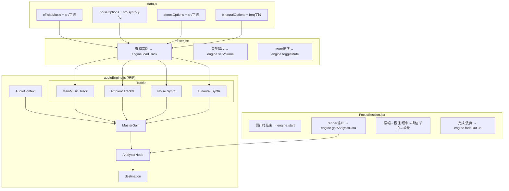

## 产品概述
为现有专注力训练应用（Healing）实现音频播放与音频驱动画布微扰功能。当前应用有完整的调音台 UI（三轨道）、专注会话流程（倒计时→绘画→奖励）和参数曲线绘制，但完全没有实际音频播放逻辑，画布的呼吸效果是固定正弦波。本次实现让音频真正响起来，并让实时音频分析数据驱动画布的视觉微扰。

## 核心功能
1. **多轨音频混合播放**：主音乐 + 白噪音/氛围音 + 双耳节拍，三轨独立音量控制、实时混合播放
2. **纯噪音实时合成**：白/粉/褐噪音由 Web Audio API 实时生成（BufferSource + 滤波器），无需音频文件
3. **双耳节拍实时合成**：Delta/Theta/Alpha/Beta 波由两个 OscillatorNode 左右声道频率差生成，无需音频文件
4. **调音台实时预览**：进入调音台页面后选择音轨即播放预览，音量滑块实时调整 GainNode，Mute 按钮实现实际静音
5. **专注会话音频播放**：倒计时结束后开始播放混音，专注期间持续播放，完成/放弃时 3 秒淡出
6. **音频驱动画布微扰**：实时频谱分析数据驱动画布——振幅→极径呼吸（替换固定正弦）、频率→相位折皱、节拍→时间步长推进速度
7. **完成提示音**：专注结束时播放柔和的完成提示音


## 技术栈
- **前端框架**：React 18 + Vite（现有项目，保持不变）
- **路由**：react-router-dom v6（现有，保持不变）
- **音频引擎**：Web Audio API（浏览器原生，无额外依赖）
- **状态管理**：现有 store.jsx Context 模式（保持不变）
- **数据**：data.js 静态导出（保持现有模式，增加 src 字段）

## 实现方案

### 核心架构
创建一个单例音频引擎模块 `audioEngine.js`，封装 Web Audio API 的全部复杂度，对外暴露简洁接口。引擎内部管理：
- 一个共享的 `AudioContext`（懒加载，首次调用时创建，遵守浏览器自动播放策略）
- 一个主 `GainNode`（主输出）连接到 `AnalyserNode` → `destination`
- 多个轨道节点（每个轨道 = 音源 + GainNode），动态创建/销毁
- `AnalyserNode` 做实时频谱分析（FFT size 2048），提供振幅 RMS、主频率、频谱质心等数据

### 音频节点拓扑
```
AudioContext
├── masterGain → analyser → destination
│
├── Track: Main Music
│   └── AudioBufferSourceNode (loop) → trackGain → masterGain
│
├── Track: Ambient/Noise
│   ├── 文件类: AudioBufferSourceNode (loop) → trackGain → masterGain
│   └── 合成类: 噪音 BufferSource → BiquadFilter → trackGain → masterGain
│
├── Track: Binaural
│   └── OscillatorNode(L, 200Hz) + OscillatorNode(R, 200+beatHz)
│       → ChannelMergerNode → trackGain → masterGain
│
└── (多个氛围音轨道，每个独立 GainNode)
```

### 关键技术决策

**1. 噪音合成 vs 文件加载**
- 白噪音：生成全频段随机噪声 Buffer，循环播放
- 粉噪音：白噪音 → BiquadFilter(-3dB/oct) 
- 褐噪音：白噪音 → BiquadFilter(-6dB/oct, lowpass)
- 理由：无需用户提供文件，实时生成无内存开销，可无限循环无衔接痕迹

**2. 双耳节拍合成**
- 左声道固定 200Hz，右声道 200+目标频率差
- 用 ChannelMergerNode 合成立体声
- 耳机佩戴时大脑感知频率差产生脑波引导效果
- 理由：无需文件，精确控制频率，可无限播放

**3. 音频分析数据结构**
引擎的 `getAnalysisData()` 返回：
```js
{
  amplitude: number,    // RMS 振幅 0-1，用于极径呼吸
  frequency: number,    // 主频率 Hz，用于相位折皱
  spectralCentroid: number, // 频谱质心 Hz，色彩/亮度感
  beat: number           // 节拍强度 0-1，通过振幅包络检测
}
```

**4. AudioContext 生命周期**
- 调音台页面：首次用户交互（选择音轨）时创建 AudioContext
- 专注会话：复用已有 AudioContext（如已从调音台进入），否则在倒计时结束时创建
- 页面卸载时 suspend/close

**5. 画布微扰映射**
- **振幅 → 极径呼吸**：`scale = baseScale * (1 + amplitude * 0.15)`，替换现有 `1 + 0.06 * Math.sin(now * 0.002)`
- **频率 → 相位折皱**：对参数 `t` 加上 `frequency * 0.0001 * sin(t)` 的小偏移，产生轻微褶皱
- **节拍 → 时间步长**：`t` 推进速度乘以 `(1 + beat * 0.3)`，节拍强时曲线推进略快

## 实现要点

### 性能
- AnalyserNode 的 `getByteFrequencyData` 每帧调用（~60fps），FFT size 2048，开销可控
- 音频文件用 `fetch` + `decodeAudioData` 一次性解码为 AudioBuffer，循环播放不重复请求
- 画布渲染循环复用现有 `requestAnimationFrame`，不新增循环

### 浏览器自动播放策略
- AudioContext 在用户交互（click/touch）后才创建/resume
- 调音台页面首次选择音轨即触发用户交互，安全创建 AudioContext
- 专注会话从 FocusConfig 的 "Begin Focus" 按钮进入，已有用户交互

### 资源路径约定
现有 Vite 项目，`public/` 目录映射到根路径。音频文件路径：
- 主音乐：`/sound/music/{filename}.mp3`
- 氛围音：`/sound/ambient/{filename}.mp3`
- data.js 中 `src` 字段存相对路径（如 `sound/music/drifting-pages.mp3`）
- 用户后续按命名规则放文件，代码用占位文件名先写好

## 架构设计



## 目录结构

```
src/
├── src/
│   ├── audioEngine.js          # [NEW] Web Audio 引擎单例。封装 AudioContext、多轨播放、噪音合成、双耳节拍合成、AnalyserNode 实时分析。暴露 init()、loadMix(mix)、start()、stop()、setVolume(trackId, vol)、toggleMute(trackId)、getAnalysisData()、fadeOut(ms) 方法
│   ├── data.js                 # [MODIFY] 为 officialMusic 每项加 src 字段（sound/music/xxx.mp3）；noiseOptions.pure 加 synth 标记；noiseOptions.ambient 和 atmosOptions 加 src 字段（sound/ambient/xxx.mp3，映射现有14个文件+占位）；binauralOptions 加 baseFreq 和 beatFreq 字段
│   ├── pages/
│   │   ├── Mixer.jsx           # [MODIFY] 引入 audioEngine，选择音轨后实时预览播放，音量滑块实时调 GainNode，Mute 按钮实现实际静音，离开页面 stop()。Mute 按钮加 active 状态切换样式
│   │   └── FocusSession.jsx   # [MODIFY] 倒计时结束调 engine.start(mix)，render 循环中调 engine.getAnalysisData() 获取振幅/频率/节拍数据驱动画布微扰（替换固定正弦呼吸），完成/放弃时 engine.fadeOut(3000)
│   └── styles.css              # [MODIFY] 新增 .track .head .mute.active 样式（Mute 激活态），可选新增音频加载状态指示器样式
└── public/
    └── sound/
        ├── music/              # [NEW DIR] 用户后续放主音乐文件
        └── ambient/           # [NEW DIR] 用户后续放氛围音文件（现有14个文件移入此处）
```

## 关键代码结构

### audioEngine.js 核心接口

```js
// audioEngine.js 暴露的接口签名（非实现）

class AudioEngine {
  // 初始化 AudioContext（需在用户交互后调用）
  init() {}
  
  // 根据 mix 对象加载所有轨道（主音乐文件、氛围音文件、合成噪音、合成双耳节拍）
  async loadMix(mix) {}
  
  // 开始播放所有已加载轨道
  start() {}
  
  // 停止所有轨道（立即）
  stop() {}
  
  // 设置某轨道音量 (0-1)
  setTrackVolume(trackId, volume) {}
  
  // 切换某轨道静音
  toggleMute(trackId) {}
  
  // 获取实时分析数据
  // 返回 { amplitude, frequency, spectralCentroid, beat }
  getAnalysisData() {}
  
  // 淡出停止（毫秒）
  fadeOut(durationMs) {}
  
  // 播放完成提示音（短促柔和音）
  playChime() {}
}

export const audioEngine = new AudioEngine()
```

### data.js 数据结构变更

```js
// officialMusic 每项增加 src 字段
{ id: 'm1', name: 'Drifting Pages', tag: 'Lo-fi', duration: '03:24', 
  cover: 'assets/album01.png', src: 'sound/music/drifting-pages.mp3' }

// noiseOptions.pure 增加 synth 标记
{ id: 'white', name: '白噪音', desc: '...', synth: true }

// noiseOptions.ambient 增加 src 字段
{ id: 'rain', name: '雨声', src: 'sound/ambient/light-rain.mp3' }

// atmosOptions 增加 src 字段
{ id: 'birds', name: '鸟鸣', src: 'sound/ambient/birds.mp3' }

// binauralOptions 增加 baseFreq 和 beatFreq
{ id: 'delta', name: 'Delta', range: '0.5–4 Hz', desc: '...',
  baseFreq: 200, beatFreq: 2 } // 左200Hz 右202Hz 差2Hz
```

