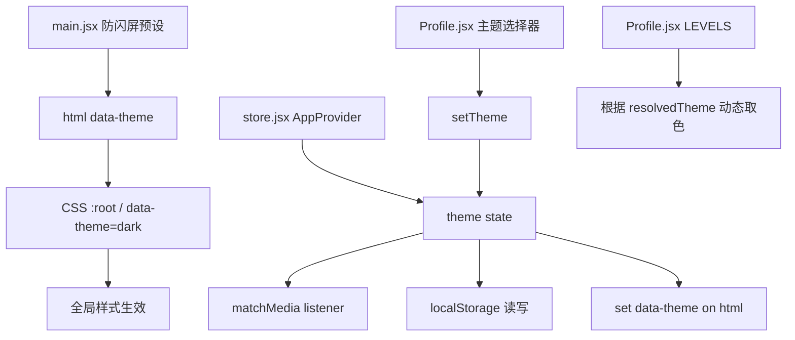

## 产品概述

为"希音 Healing"应用实现深色模式，采用深灰柔和风格，背景为深灰色系，柔和不刺眼，保留纸质质感。支持三种模式：浅色 / 深色 / 跟随系统，在 Profile 设置页提供切换入口，偏好持久化到 localStorage。

## 核心功能

- 三档主题切换：浅色、深色、跟随系统（`prefers-color-scheme`）

- 设置页（Profile）外观组新增主题选择器，与语言选择器同组

- 主题偏好持久化到 localStorage，应用启动时立即应用，避免闪屏（FOUC）

- 深色模式下所有页面颜色正确切换

- 水墨专注画布保持自身配色体系（已有深底浅线设计），不受主题切换干扰

## 技术栈

- 现有项目：React + Vite + 纯 CSS 变量系统

- 无需引入新依赖，利用 CSS 自定义属性 + `data-theme` 属性实现主题切换

## 实现方案

### 核心策略

项目 `:root` 中已定义完整的 CSS 变量体系（`--bg`、`--ink`、`--line` 等 10 个变量），所有页面均通过 `var(--xxx)` 引用。只需在 `[data-theme="dark"]` 选择器下重定义这些变量即可全局生效。

### 主题切换机制

1. **三档模式**：`light` / `dark` / `system`

2. **持久化**：独立 key `healing_app_theme_v1` 存入 localStorage（参考现有 `LANG_KEY` 模式）

3. **应用层**：在 `<html>` 元素上设置 `data-theme` 属性

4. **跟随系统**：通过 `window.matchMedia('(prefers-color-scheme: dark)')` 监听系统变化，实时切换

5. **防闪屏**：在 `main.jsx` 中、React 渲染前，同步读取 localStorage 并设置 `html.dataset.theme`

### 深色模式色值方案（深灰柔和风格）

| 变量 | 浅色值（现有） | 深色值（新增） | 说明 |

|------|---------------|---------------|------|

| `--bg` | `#ffffff` | `#1a1a1a` | 主背景，深灰柔和 |

| `--bg-soft` | `#f7f7f6` | `#242424` | 次级背景（卡片/输入框底） |

| `--ink` | `#111111` | `#e8e6e3` | 主文字，暖白略带纸感 |

| `--ink-soft` | `#555555` | `#a8a6a3` | 次级文字 |

| `--ink-muted` | `#9a9a9a` | `#6a6865` | 弱化文字/占位 |

| `--line` | `#e5e5e3` | `#333333` | 分割线/边框 |

| `--line-strong` | `#cfcfcd` | `#444444` | 强调边框/滑块轨道 |

| `--accent` | `#111111` | `#e8e6e3` | 强调色（与 ink 一致） |

| `--canvas-bg` | `#0c0c0c` | `#0c0c0c` | 专注画布背景，保持不变 |

| `--canvas-line` | `#f1efe8` | `#f1efe8` | 专注画布线条色，保持不变 |

### 新增 CSS 语义变量（使硬编码色可主题化）

在 `:root` 中新增，在 `[data-theme="dark"]` 中重定义：

- `--shell-bg`：手机框外背景（现 `#efefee`）

- `--nav-bg`：底部导航毛玻璃（现 `rgba(255,255,255,0.95)`）

- `--card-focus`：专注入口卡片色（现 `#DEE4F4`）

- `--card-mix`：调音入口卡片色（现 `#fbede0`）

- `--btn-focus`：专注按钮色（现 `#F9D2E2`）

- `--heatmap-empty`：热力图空格色（现 `#ebedf0`）

- `--overlay-light`：轻遮罩（现 `rgba(255,255,255,0.7)`）

- `--scrollbar-track`：滚动条轨道（现 `rgba(0,0,0,0.06)`）

- `--scrollbar-thumb`：滚动条滑块（现 `rgba(0,0,0,0.25)`）

### 保持不变的硬编码色（跨主题通用）

- `.suminagashi-*` 系列：水墨画布专用和纸色（`#efeae0`、`#1a1a1f` 等）

- `.focus-session` 画布色：已有深底浅线设计

- `.google-icon` / `.apple-icon` / `.wechat-icon`：品牌色

- `#9a4a4a`：警示红（注销/删除按钮）

- `.heatmap-bubble`：tooltip 深底白字

- `.modal-mask` / `.sheet-mask`：遮罩半透明黑

## 实现要点

- **防闪屏**：`main.jsx` 中 `ReactDOM.createRoot().render()` 之前，同步执行 `document.documentElement.dataset.theme = localStorage.getItem('healing_app_theme_v1') || 'system'`，若为 system 则立即查询 matchMedia 解析

- **系统模式监听**：`store.jsx` 的 `AppProvider` 中通过 `useEffect` 注册 `matchMedia` listener，当模式为 `system` 时实时响应系统主题变化

- **解析最终主题**：`resolveTheme(mode)` 函数 — system 模式查询 matchMedia 返回 light/dark，否则直接返回 mode

- **热力图颜色**：`Profile.jsx` 的 `LEVELS` 数组需根据 resolvedTheme 动态取色，level 0 在深色下用 `var(--heatmap-empty)` 对应值（`#2a2a2a`）

- **过渡动画**：`html` 添加 `color-scheme: light dark`，全局元素添加 `transition: background-color 0.2s, color 0.2s, border-color 0.2s` 使切换平滑

- **性能**：CSS 变量切换是浏览器原生层级的重绘，无 JS 遍历 DOM 开销；matchMedia listener 仅在系统主题变化时触发，无性能问题

## 架构设计



## 目录结构

```
src/src/

├── styles.css              # [MODIFY] 新增 [data-theme="dark"] 变量块 + 提取硬编码色为变量 + 深色过渡动画

├── main.jsx                # [MODIFY] 渲染前同步预设 html data-theme，防 FOUC

├── store.jsx               # [MODIFY] 新增 theme 状态 + matchMedia 监听 + 持久化 + 暴露 theme/setTheme/resolvedTheme

├── i18n.js                 # [MODIFY] 新增 theme.light / theme.dark / theme.system / profile.theme 翻译键

└── pages/

    └── Profile.jsx         # [MODIFY] 设置页新增外观组 + 主题三选一选择器 + LEVELS 动态取色
```

### 文件修改详情

**`src/src/styles.css`** — 核心修改

- `:root` 中新增 9 个语义变量（`--shell-bg`、`--nav-bg`、`--card-focus`、`--card-mix`、`--btn-focus`、`--heatmap-empty`、`--overlay-light`、`--scrollbar-track`、`--scrollbar-thumb`）

- 将以下选择器中的硬编码色替换为变量：`.app-shell`(L59)、`.bottom-nav`(L106)、`.card-hero.focus-entry`(L258)、`.card-hero.mix-entry`(L265)、`.focus-start-btn`(L296)、`.login-body`(L984)、`.player-hint`(L2669)、`.tap-to-play-overlay`(L2695)、`.heatmap-cell`(L2051)、`.heatmap-scrollbar`(L2069)、`.heatmap-scrollbar-thumb`(L2080)

- 新增 `[data-theme="dark"]` 块，重定义全部 CSS 变量为深灰色值

- 新增 `html { color-scheme: light dark; }` 声明

- 全局元素添加 `transition: background-color 0.2s ease, color 0.2s ease, border-color 0.2s ease`

- 水墨画布相关类（`.suminagashi-*`、`.focus-session`）保持不变

**`src/src/main.jsx`** — 防闪屏

- 在 `import './styles.css'` 之后、`ReactDOM.createRoot().render()` 之前，同步读取 localStorage 主题并设置 `document.documentElement.dataset.theme`

- 若为 `system`，查询 `matchMedia('(prefers-color-scheme: dark)')` 并设置解析后的值

**`src/src/store.jsx`** — 主题状态管理

- 新增 `THEME_KEY = 'healing_app_theme_v1'`

- 新增 `theme` state（默认 `'system'`），从 localStorage 初始化

- 新增 `resolvedTheme` 派生值（light/dark），通过 useMemo 计算

- `useEffect` 注册 `matchMedia` listener，system 模式下实时更新 resolvedTheme

- `changeTheme` callback：更新 state + 写 localStorage + 设置 html data-theme

- `value` useMemo 中暴露 `theme`、`setTheme: changeTheme`、`resolvedTheme`

**`src/src/i18n.js`** — 翻译键

- 新增 `profile.theme`：`{ zh: '外观', en: 'Appearance' }`

- 新增 `theme.light`：`{ zh: '浅色', en: 'Light' }`

- 新增 `theme.dark`：`{ zh: '深色', en: 'Dark' }`

- 新增 `theme.system`：`{ zh: '跟随系统', en: 'System' }`

**`src/src/pages/Profile.jsx`** — UI 接入

- 在"关于"设置组之前新增"外观"设置组，包含主题三选一选择器（复用现有 `.lang-selector` / `.lang-btn` 样式）

- 从[User Cancelled]
